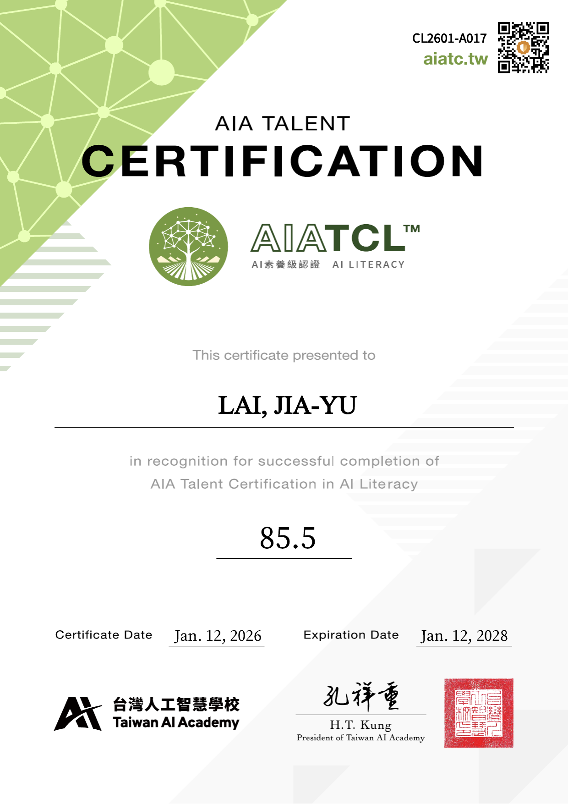

# 書審資料專案 — CLAUDE.md

## 專案概述

本專案為**賴家煜**申請二技甄選入學的書審資料，以單一 HTML 檔案（`resume_1.html`）製作，可直接用瀏覽器 Ctrl+P 輸出 A4 PDF。

- **申請身份**：國立臺中科技大學 五專部 資訊工程科 畢業
- **申請目標**：資工系 / 資管系 二技甄選

---

## 檔案清單

| 檔案 | 說明 |
|---|---|
| `resume_1.html` | 主檔，全部書審內容（封面、目錄、履歷、自傳、競賽、實習、附件） |
| `resume_1_backup.html` | 備份，修改前請勿覆蓋 |
| `自傳.md` | 自傳原稿（已匯入 HTML） |
| `自傳_資訊工程版.md` | 資工系版自傳草稿 |
| `自傳_資訊管理版.md` | 資管系版自傳草稿 |
| `aiatcl.png` | AI 素養級認證證書圖片 |
| `pcqc.png` | 科技英文 PVQC 證書圖片 |
| `ithelp鐵人賽.png` | iThome 鐵人賽完賽截圖 |
| `入選證書.png` | 入選證書圖片 |
| `影像 (13).png` | 其他圖片素材 |

---

## HTML 頁面結構

| 頁碼 | HTML ID | class | 內容 |
|---|---|---|---|
| 1 | — | `.page .page-cover` | 封面（Logo + 書審資料 + 姓名） |
| 2 | `#toc` | `.page .page-doc` | 目錄（可點擊錨點跳轉） |
| 3 | `#resume` | `.page` | 履歷第一頁（學歷、學術發表、技術能力） |
| 4 | — | `.page` | 履歷第二頁（工作經驗、作品集、證照） |
| 5 | `#bio-1` | `.page .page-doc` | 一、自傳 ─ （一）學習歷程與思維養成 |
| 6 | `#bio-2` | `.page .page-doc` | 一、自傳 ─ （二）實務積累與研究突破 |
| 7 | `#section-2` | `.page .page-doc` | 二、競賽成果與學術發表（待填） |
| 8 | `#section-3` | `.page .page-doc` | 三、實習經歷與作品集（待填） |
| 9 | `#appendix-1` | `.page .page-doc` | 附件一（待置入） |
| 10 | `#appendix-2` | `.page .page-doc` | 附件二（待置入） |

---

## CSS 設計系統

### 色彩

```
--accent:       #1a5276   主色（標題、邊框、強調）
--accent-light: #2980b9   輔色（日期、tag badge）
--accent-bg:    #eaf2f8   淺底色（卡片背景）
--page-bg:      #F9F9F9   頁面底色
--text-primary:   #1c1c1c  （列印覆寫為 #000000）
--text-secondary: #444444  （列印覆寫為 #111111）
--text-muted:     #666666  （列印覆寫為 #333333）
--border:       #d5d8dc
```

### 字型

- 中文：標楷體（DFKai-SB / BiauKai）
- 英文：Times New Roman
- serif fallback

### 頁面邊距

| 頁面類型 | class | padding |
|---|---|---|
| 履歷頁 | `.page` | `1cm` 四邊 |
| 書審文件頁 | `.page-doc` | 上下 `2.54cm`、左右 `2.5cm` |
| 封面 | `.page-cover` | 上下 `3cm / 2.5cm`、左右 `2.5cm` |

---

## 主要 CSS 元件

| class | 用途 |
|---|---|
| `.section-title` | 區段標題（◆ + 文字，底線）|
| `.edu-card` | 學歷卡片（方形邊框、成績統計格）|
| `.pub-card` | 學術發表卡片（badge 標籤）|
| `.skill-table` | 技能表格 + chip 標籤 |
| `.exp-item` | 工作經歷項目 |
| `.project-item` | 作品集項目 |
| `.cert-list` | 證照列表 |
| `.bio-sub-title` | 自傳子標題（左側 4px 藍線）|
| `.bio-content p` | 自傳內文（14px、首行縮排 2em、行高 1.9）|
| `.figure-block` | 圖片預留區（虛線框 + 圖號說明）|
| `.content-placeholder` | 文字內容預留框（虛線、灰字）|
| `.toc-list` | 目錄清單（錨點連結）|
| `.attachment-title` | 附件頁標題 |

---

## 設計規範

- **不使用 border-radius**：所有卡片、方框一律方角（`border-radius: 0`）
- **顏色**：accent 色 `#1a5276` 為主，所有標題、邊框、數字、label 均使用此色
- **圖片編號**：依頁面順序連續，圖一、圖二… 格式，caption 置於圖片正下方
- **列印修正**：`@media print` 內文字色覆寫為接近純黑，移除 box-shadow，`.page-doc` padding 另行覆寫

---

## 待完成項目

- [ ] 封面：置入學校 Logo 圖片（替換 `.cover-logo-placeholder`）
- [ ] 封面：確認系別名稱（目前為 `xxxxx 系`）
- [ ] 第 7 頁（二、競賽成果）：撰寫三個子項目內文並置入圖片
- [ ] 第 8 頁（三、實習經歷）：撰寫四個子項目內文並置入圖片
- [ ] 附件一、二：置入證書 / 作品截圖（`aiatcl.png`、`pcqc.png` 等）
- [ ] 目錄頁碼：內容確定後對齊實際頁碼
- [ ] 大頭照：替換履歷第一頁的 `.photo-placeholder`

---

## 圖片置入方式

將 `figure-placeholder` 替換為 `` 標籤：

```html
<!-- 原本 -->
<div class="figure-placeholder">[ 請置入圖片 ]</div>

<!-- 替換後 -->

```

---

## 輸出 PDF

1. 瀏覽器開啟 `resume_1.html`
2. `Ctrl + P`
3. 目的地選「另存為 PDF」
4. 紙張大小：A4，邊界：無
5. 勾選「背景圖形」確保色彩正確輸出
